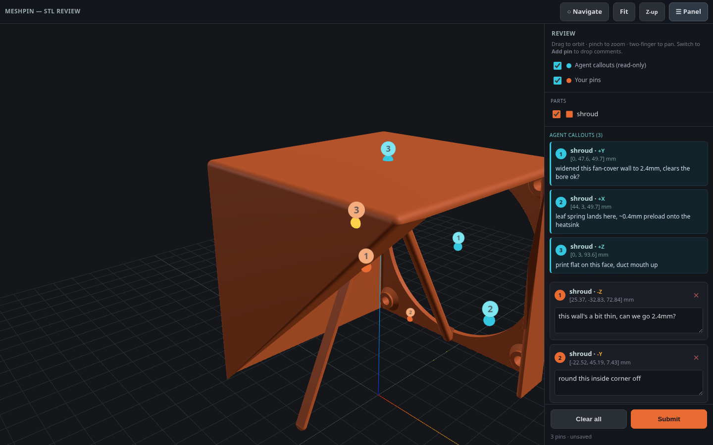

# Annealage Mesh

Annealage Mesh is a little web tool for reviewing 3D-print models by pointing at them. You give it a folder of STL files, it serves up a 3D viewer in the browser, and you click on the model to drop a comment pinned to that exact spot. Hit submit and the comments land in a JSON file next to the STLs, each one carrying the 3D location it was placed at.

## Why

I built this while iterating on a 3D-printed part with Claude Code. The CAD was generated from a script, I'd look at a render, and then spend ages typing things like "no, the inside corner on the far wall near the fan, not that one" trying to describe which face I meant. It was a pain, and half the time the agent picked the wrong spot anyway.

Pointing at the thing is just so much easier. So we built a viewer where I click the face and type the comment right there, and the agent gets it back with the actual coordinates, no guessing.

It's bidirectional too, which turned out to be the good bit. The agent can write its own callouts (a location plus a note) and they show up as pins in the viewer for me to see and reply to. So it ends up being a shared review surface, I mark up what I want changed, the agent pins its questions on the geometry, and we go back and forth pointing at the same model instead of describing it in words.

## Install

Annealage Mesh is a Python package with no runtime dependencies (the 3D viewer pulls three.js from a CDN in the browser), so it runs pretty much anywhere with Python 3.9+.

Run it straight from GitHub, nothing to install, via uv:

    uvx --from git+https://github.com/Annealage/mesh annealage-mesh ./path/to/stls

Or install it as a tool:

    uv tool install git+https://github.com/Annealage/mesh
    # or
    pipx install git+https://github.com/Annealage/mesh

Once it's up on PyPI that shortens to `uvx annealage-mesh ./stls` / `pipx install annealage-mesh`.

## Usage

Point it at a directory of STL files:

    annealage-mesh ./build

It starts a local server, prints the URLs, and opens your browser at http://localhost:8765/. Every `.stl` in that directory shows up in the viewer; toggle them on/off in the side panel.

- Drag to orbit, scroll / pinch to zoom, right-drag or two-finger to pan.
- Flip to "Add pin" mode, click the model to drop a pin, then type a comment against it in the panel.
- Hit Submit. Your pins get written to `mesh-comments.json` in the served directory.
- Need a distance between two features? Pick any two placed pins (yours or an agent's) in the
  "Measure" panel for ΔX/ΔY/ΔZ and the direct distance, shown as a line between them in the view.

It works on a phone too, the panel folds away behind a button up top and navigation is all touch (one finger orbits, two fingers pan / zoom).

A couple of files turn up in the served directory:

- `mesh-comments.json` — your pins and comments, written on submit (also appended to `mesh-comments.log`). This is what a reviewing tool or agent reads.
- `mesh-callouts.json` — callouts to show in the viewer. Write pins here and they appear live (cyan, read-only) for whoever's looking. This is how an agent points back at the model.

## For AI agents

Annealage Mesh is built to sit between a human and an AI agent working on a 3D model together. If you're an agent (or setting one up), the contract is just two JSON files in the served directory.

Read the human's feedback from `mesh-comments.json`:

    {
      "submitted_at": "...",
      "count": 1,
      "annotations": [
        { "id": 1, "part": "bracket", "label": "+Z", "point": [12.5, -3.2, 44.0],
          "normal": [0, 0, 1], "faceIndex": 1234, "comment": "this fillet's too sharp" }
      ]
    }

`point` is the click location in model space (same units as the STL), so you can map a comment straight to a spot in the CAD script that generated it.

Write your own callouts to `mesh-callouts.json` and they show up as cyan pins in the viewer, live (the page polls, no reload needed):

    {
      "annotations": [
        { "id": 1, "author": "agent", "part": "bracket", "label": "+Y", "point": [0, 20, 10],
          "comment": "moved this wall out 2mm, that clear enough?" }
      ]
    }

`point` and `comment` are the only fields that really matter, the rest are display niceties.

There's also a Claude Code skill in `skill/` that wires this up as a workflow, so you can just tell Claude to use Annealage Mesh when it's working on printable models.

## Licence

[PolyForm Noncommercial 1.0.0](LICENSE) — free to use for any noncommercial purpose. Commercial use needs a separate licence; see [COMMERCIAL.md](COMMERCIAL.md).

The Claude Code skill in [`skill/annealage-mesh/`](skill/annealage-mesh/) is MIT, so it can be copied into any agent configuration without restriction.
