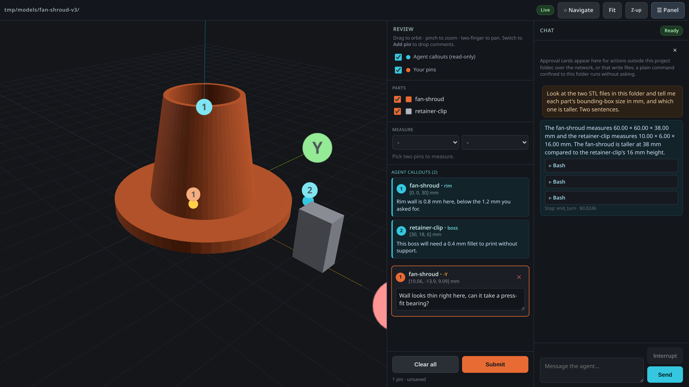
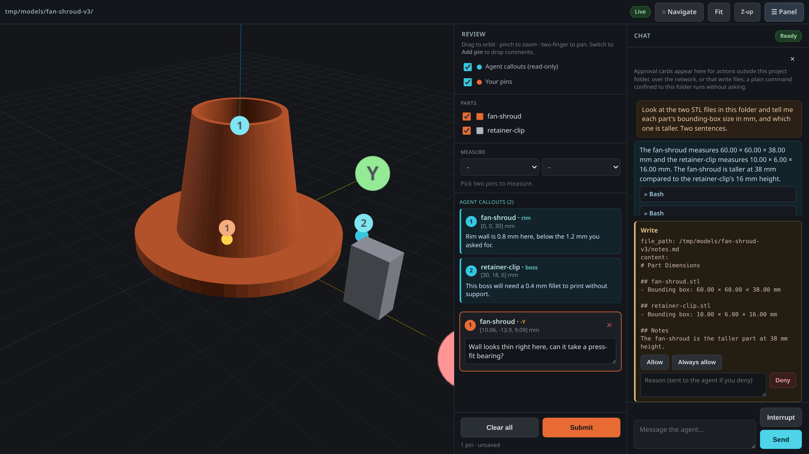

# Annealage Mesh

Annealage Mesh turns a folder into a workshop for a 3D-printable part, with the model and the agent building it in the same window.

Describe the part. The agent writes the CAD source in that folder, runs it, and the STL it produces appears in the viewer beside the chat. Look at the result, click the face that is wrong, say why. It edits the source, regenerates, and the geometry updates in front of you. Nobody describes a location in words, and nobody reloads anything.

## The loop

**Point instead of describing.** Click a face and type. The comment carries the click point in model space, the surface normal and the part name, so it maps to a spot in the source that generated it rather than to a paragraph of "the inside corner near the fan, not that one".

**The agent works in the folder.** The chat pane is a Claude Code session whose working directory is the directory being served, so it reads and writes the CAD source, runs the generator, measures the mesh, and inspects its own output. You watch that happen next to the thing it is talking about, streaming token by token, with the cost of each turn.

**Regenerating a part updates the view.** A new STL appears, a rewritten one replaces its geometry, a deleted one goes. The camera stays where you put it, and a part half-written to disk is waited for rather than shown broken. This is what makes it an iteration loop rather than a viewer you keep refreshing.

**Callouts come back onto the geometry.** The agent writes a location and a note; it appears as a cyan pin in your view. So it can ask "is this the wall you meant?" by pointing, and you can answer by pinning next to it.

**You approve what matters.** A shell command confined to the project folder runs without asking, which is what makes regenerating a part fast enough to iterate on. Editing a file, writing outside the folder, or reaching the network raises a card showing exactly what was requested, to allow, always-allow, or deny with a reason the agent receives.

**Measure between any two pins.** Pick two pins, yours or the agent's, for ΔX/ΔY/ΔZ and the direct distance, drawn in the view. Useful for answering "how far is this boss from that wall" without going back to the source.

**It works from a phone.** The panes become tabs, navigation is touch, and pins and approvals both work. Reviewing a print next to the printer while the agent iterates on the desktop is a real workflow, and `--host tailscale` is one flag.

## What is not here yet

Stated plainly, because the loop above is real and these are not:

- The agent cannot drive the viewer itself. It cannot frame a pin, hide a part or capture what you are looking at; those tools are the next milestone.
- No image upload and no sketching on the model. You point with pins, not by drawing.
- No project scaffolding. Mesh serves a folder you already have; it does not yet set one up, choose a CAD toolchain, or write a starter script.

So the CAD source is whatever you and the agent decide to use in that folder, with whatever generator it can run there. Mesh does not supply or prescribe one.

## Install

Python 3.10 or newer, and two runtime dependencies: [microdot](https://github.com/miguelgrinberg/microdot), and the Claude Agent SDK, which is how the chat pane talks to Claude Code. three.js is vendored in the package and served locally, so the viewer needs no network access.

Be ready for the size: the SDK bundles the Claude Code CLI itself, so installing pulls roughly 90 MB rather than a few tens of kilobytes. That is the cost of the agent being part of the tool rather than something you wire up separately.

Run it without installing anything:

    uvx --from git+https://github.com/Annealage/mesh annealage-mesh ./path/to/part

Or install it as a tool:

    uv tool install git+https://github.com/Annealage/mesh
    # or
    pipx install git+https://github.com/Annealage/mesh

**On Linux, agent mode also needs `bubblewrap` and `socat`** (`apt install bubblewrap socat`, or your distribution's equivalent). They are what confines the agent's shell, and agent mode refuses to start without them rather than quietly running an uncontained one. macOS sandboxes with a mechanism built into the OS and needs nothing extra. If you would rather not install them, `--no-agent` runs the viewer alone, which needs neither.

## Using it

    annealage-mesh ./part

It serves the directory, prints the URL with a per-run token, and opens your browser. Every `.stl` in the tree appears in the viewer, including ones that arrive later.

- Drag to orbit, scroll or pinch to zoom, right-drag or two fingers to pan.
- Switch to **Add pin**, click the model, then type a comment against the pin in the panel.
- **Submit** writes your pins to `mesh-comments.json`, which is what the agent reads.
- Type in the chat pane to put the agent to work in that folder.

Full walkthrough, including the modelling loop, sessions, the approval model, remote access and every flag: **[docs/user-guide.md](docs/user-guide.md)**.

## What it puts in your folder

- `mesh-comments.json` — your pins, written on Submit, and appended to `mesh-comments.log`.
- `mesh-callouts.json` — the agent's callouts. Anything here shows up as a cyan pin, live.
- `.mesh/` — session transcripts, remembered approvals, and the lock that stops two servers fighting over one directory.

Everything else in the folder is yours and the agent's: the CAD source, the STLs, whatever build script you use.

## Security

Mesh hands an AI agent a shell in a directory you chose, and serves a page that can drive it, so it is worth being plain about the boundaries.

**The agent's shell is confined.** Writes land inside the project folder; writes elsewhere and network access are refused by the sandbox or reach you as an approval card. The model cannot opt out of that containment for a command by asking. The startup banner states which posture is actually in effect every run, rather than assuming the one it asked for. Note the honest limit: the sandbox restricts writes and network, **not reads**, so a confined shell can still read any file your user can.

**The server is bound to loopback and tokened.** Non-loopback binds are supported, not hidden behind a scare-flag, and the banner tells you what the server is reachable on every run. On any non-loopback bind the token stops being defence in depth and becomes the control that matters.

**A folder's Claude configuration is not trusted until you say so.** A `.claude/settings.json` or `.mcp.json` can name shell commands to run, one of them before any prompt is sent, and unpacking someone else's model archive is an ordinary thing to do. Agent mode refuses to start when a served folder carries configuration you have not accepted, and rechecks it on every tool call, so a change mid-session stops the agent rather than silently widening what it may do.

## Working with an agent outside the window

The chat pane is the intended way in, but the file contract is stable and unchanged, so a separately running agent still works: read `mesh-comments.json`, write `mesh-callouts.json`.

    {
      "annotations": [
        { "id": 1, "part": "bracket", "label": "+Z", "point": [12.5, -3.2, 44.0],
          "normal": [0, 0, 1], "faceIndex": 1234, "comment": "this fillet's too sharp" }
      ]
    }

`point` and `comment` are the fields that matter; the rest are display niceties. There is also a Claude Code skill in [`skill/annealage-mesh/`](skill/annealage-mesh/) that wires this up as a workflow.

## Licence

[PolyForm Noncommercial 1.0.0](LICENSE) — free for any noncommercial purpose. Commercial use needs a separate licence; see [COMMERCIAL.md](COMMERCIAL.md).

The Claude Code skill in [`skill/annealage-mesh/`](skill/annealage-mesh/) is MIT, so it can be copied into any agent configuration without restriction.
