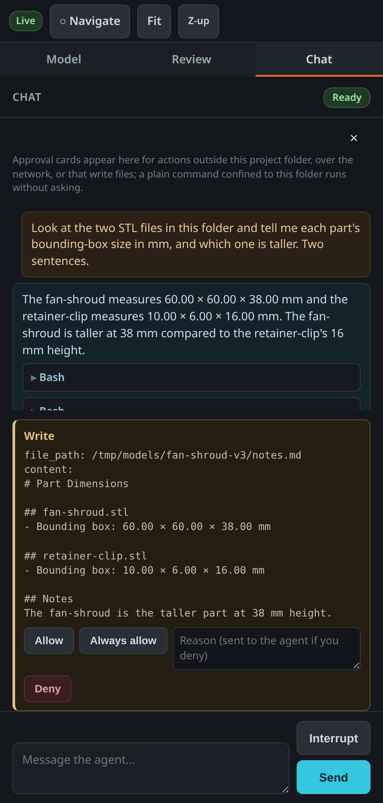

# Annealage Mesh user guide

This is the full walkthrough for using Mesh to build and review a 3D-printable part with an agent. For what the tool is and how to install it, start with the [README](../README.md).

## Contents

- [First run](#first-run)
- [The three panes](#the-three-panes)
- [The modelling loop](#the-modelling-loop)
- [Placing pins](#placing-pins)
- [Working with the agent](#working-with-the-agent)
- [Approving what the agent does](#approving-what-the-agent-does)
- [Sessions](#sessions)
- [Reviewing from a phone](#reviewing-from-a-phone)
- [Trusting a folder's Claude configuration](#trusting-a-folders-claude-configuration)
- [Files in your directory](#files-in-your-directory)
- [Every flag](#every-flag)
- [When something is wrong](#when-something-is-wrong)

## First run

Point it at a directory of STL files:

    annealage-mesh ./build

The startup output is worth reading once, because it tells you four things you would otherwise have to guess at:

    Annealage Mesh
      serving STLs from : /home/you/build
      human comments    : /home/you/build/mesh-comments.json  (written on submit)
      comments log      : /home/you/build/mesh-comments.log
      agent callouts    : /home/you/build/mesh-callouts.json  (agent writes here to show pins)
      session           : 20260812T135919Z-96c60120  (fresh)
    Annealage Mesh is serving on loopback on 127.0.0.1:8765
      open: http://127.0.0.1:8765/#t=VMMChzhTMI_b9w8ON_IJWg
      reachable from this machine only
      agent posture: sandbox ACTIVE - bash runs contained and unprompted; edit, write and network still need your approval
      (Ctrl-C to stop)

The URL carries a per-run token in its fragment, which the browser keeps out of server logs and out of the `Referer` header. The **exposure line** says what the server is reachable on, and prints every run whether or not you passed `--host`, because a default is exactly the case where nobody typed a flag to remind them. The **agent posture** line says which containment is actually in effect rather than the one that was requested; if a dependency is missing it says so and names it.

Your browser opens automatically. `--no-open` stops that.

## The three panes

**The model**, on the left, is the 3D view. Drag to orbit, scroll or pinch to zoom, right-drag or two fingers to pan. `Fit` reframes everything visible; `Z-up` switches which axis is up, for models exported from a Y-up tool.

**Review**, in the middle, lists the parts, your pins, the agent's callouts, and the measure controls. Every `.stl` under the served directory appears under **Parts** with a colour and a visibility checkbox, including ones generated after the page was opened. A part keeps its colour for the life of the page, so a newly generated part does not recolour the others. Hiding a part also stops you pinning it, since you can only pin what you can see.

**Chat**, on the right, is the agent. It shows a status pill (Connecting, Ready, Unavailable), the transcript, tool cards you can expand, approval cards, and the composer.

Agent health never affects the viewer. If the agent cannot start, or dies mid-session, the model, the pins and Submit keep working and the chat pane tells you what happened and what to do.

## The modelling loop

This is what the tool is for, so it is worth spelling out as a sequence.

1. **You describe the part**, in the chat pane, in whatever terms you would use to a colleague. "A shroud for a 40 mm fan, 38 mm tall, with a 3 mm flange and four M3 holes on a 32 mm square."
2. **The agent writes the source and runs it.** It has a shell in this folder, so it creates whatever script the toolchain you are using needs, runs it, and produces an STL. A command confined to this folder runs without asking, which is what keeps this step quick enough to repeat.
3. **The part appears.** You do not reload and you do not restart anything. A new STL shows up in the viewer with its own colour and its own checkbox; a regenerated one replaces the geometry in place, with the camera left exactly where you put it.
4. **You point at what is wrong.** Switch to Add pin, click the face, type the problem. Submit.
5. **The agent reads the coordinates and revises.** It edits the source, regenerates, and step 3 happens again.

Repeat until the part is right, then print it.

Two details make step 3 behave sensibly rather than fighting you. A part still being written to disk is waited for rather than shown, so you never see a half-generated mesh or a load failure for a file that was about to be fine. And a part regenerated twenty times leaves one mesh in the scene, not twenty stacked copies.

Mesh does not choose your CAD toolchain, and does not supply one. Whatever the agent can install or run in that folder is what you get; OpenSCAD, build123d, CadQuery and a hand-written mesh generator all work the same way from Mesh's point of view, because all it watches for is the STL. If you have a preference, say so in the first message, or put it in a `CLAUDE.md` in the folder, which the agent reads.

## Placing pins

1. Click **Navigate** in the top bar to switch it to **Add pin**.
2. Click the model. A numbered orange pin drops exactly where you clicked.
3. Type your comment against that pin in the Review panel.
4. Click **Submit**.

Submit writes every pin to `mesh-comments.json` in the served directory and appends the same payload to `mesh-comments.log`, so the history survives being overwritten. Each pin carries the click point in model space, the surface normal, the face index and the part name.

**Measure** takes any two placed pins, yours or the agent's, and reports ΔX, ΔY, ΔZ and the direct distance, drawn as a line in the view. This is the quickest way to answer "how far is this boss from that wall" without going back to the CAD.

Pins are yours and editable; callouts from the agent are read-only, and the two toggles at the top of the Review panel show or hide each set.

## Working with the agent

The chat pane is a Claude Code session whose working directory **is** the folder being served. So it can read the CAD script that generated the STLs, run the generator, measure the mesh, and edit the source, all in the place the models came from.

Useful things to ask, in rough order of how much they play to the tool's strengths:

- "Write the OpenSCAD for a 40 mm fan shroud, 38 mm tall, and generate the STL."
- "Read `mesh-comments.json` and address the pin on the fan shroud."
- "The rim near pin 2 looks thin. Measure the wall there and tell me what it is."
- "Regenerate the shroud with a 1.2 mm rim and tell me what changed."
- "Put a callout on each face you think will need support."

That last one is the other half of the pointing: when the agent writes `mesh-callouts.json`, those callouts appear in your view within a fraction of a second, pinned to the coordinates it chose. You can then pin a reply next to its callout and Submit, and it reads your coordinates back. Neither side ever describes a location in words.

The composer sends on the button; **Interrupt** stops a turn already in flight. Each completed turn shows its stop reason and cost.

## Approving what the agent does

The split is by consequence, not by tool:

**Runs without asking.** A shell command the sandbox judges confined to the project folder. Reading and writing files inside the folder, running your generator, listing things. This is the common case and prompting for it would make the tool unusable.

**Asks first.** Editing or writing a file through the agent's own file tools, anything reaching the network, and any command the sandbox cannot confine. You get a card naming the tool and showing its full arguments, with a multi-line command or file content laid out as text rather than crammed into one JSON line, because this is the thing you are being asked to read.

Three buttons:

- **Allow**, this one call.
- **Always allow**, this tool for the rest of the session, and remembered in `.mesh/permissions.toml` for future runs in this directory. Never offered for `Bash`, and refused for it even if something asks: one careless click should not become a standing grant of shell access.
- **Deny**, with an optional reason, which the agent receives verbatim. "Not that file, change the enclosure instead" is more useful to it than a bare refusal.

A card stays on screen, dimmed, while your decision is in flight, and disappears when the server confirms it. If you have the same card open on a phone and a laptop and answer on both, the second one is told its decision did not apply and what happened instead, rather than silently appearing to work.

If nothing is left to answer a request, because every browser closed, the request is denied and the agent is told why. Requests also expire after five minutes.

## Sessions

Each run gets a session, recorded under `.mesh/sessions/`, holding the event log for the conversation.

    annealage-mesh ./build -c              # continue the most recent session here
    annealage-mesh ./build -r              # list this directory's sessions and exit
    annealage-mesh ./build -r 20260812T…   # resume that one

`-r` takes its session id from the next token unconditionally, so `annealage-mesh -r ./build` reads `./build` as a session id. Put the directory first, or write `--resume=SID`.

Reloading the browser mid-turn loses nothing: the conversation belongs to the session rather than to the socket, so the page replays what it missed and carries on streaming. Closing the browser entirely and reopening it does the same.

One server per directory at a time. A second one refuses to start and tells you what the first is serving, because two agents resuming one session, or two writers on one event log, is corruption rather than an inconvenience.

## Reviewing from a phone

Below about 900 px wide the panes become tabs: Model, Review, Chat. Everything works, including pins and approval cards.

To reach it from a phone, the simplest safe route is Tailscale:

    annealage-mesh ./build --host tailscale

That resolves this host's tailnet address and binds only that, which is why it is an alias rather than something you assemble yourself. The banner prints the URL to open, token included. If you front it with `tailscale serve` or another reverse proxy, the browser's `Origin` will be that proxy's name, so pass it with `--origin https://name.ts.net`.

You can also bind an address directly, including `0.0.0.0` for every interface. Mesh does not stop you and does not hide it behind a warning flag, but understand what changes: on a non-loopback bind the per-run token is no longer defence in depth, it is the control, and anyone who has the URL has the agent.

## Trusting a folder's Claude configuration

A directory can carry files the `claude` CLI obeys: `.claude/settings.json`, `.claude/settings.local.json`, scripts under `.claude/hooks/`, and `.mcp.json`. Those can grant tool permissions without asking you, and they can declare hooks, which are shell commands, one kind of which runs when the session opens, before any prompt is sent. Downloading and unpacking someone else's model archive is an ordinary thing to do, so a folder is not automatically trusted.

An ordinary folder of STL files has none of those files and you will never see this. When one does, agent mode refuses to start:

    error: /home/you/pack carries Claude configuration that this run has not been told to trust.
        /home/you/pack/.claude/settings.json
      Those files can declare hooks, which are shell commands the agent's CLI runs,
      and a session-start hook runs before any prompt is sent. Review them, then:
        accept them for this directory : annealage-mesh --trust-project-config
        or run the viewer with no agent : annealage-mesh --no-agent

Read the files, then accept them with `--trust-project-config`. Acceptance is recorded in your own configuration directory, not in the folder, against a digest of the exact content you reviewed. Any later change to those files asks again, including a change the agent itself makes.

The same digest is checked before every tool call, so if that configuration changes while the session is running, every subsequent call is refused and the chat pane tells you. Restart to review the change.

`CLAUDE.md` is deliberately not part of this. It cannot execute, and every tool call it might provoke still faces the sandbox and your approval. Gating it would prompt about nearly every real project and teach you to accept without reading, which costs more than it buys.

## Files in your directory

| Path | What it is |
| --- | --- |
| `mesh-comments.json` | Your pins, rewritten on each Submit. |
| `mesh-comments.log` | Every Submit ever, appended, one JSON object per line. |
| `mesh-callouts.json` | The agent's callouts. Edit it by hand and the viewer updates live. |
| `*.stl` | Your parts. Added, regenerated or deleted, the viewer follows within a fraction of a second. |
| `.mesh/sessions/` | One directory per session, holding its event log. |
| `.mesh/permissions.toml` | Tools you chose "Always allow" for. Plain TOML, safe to edit or delete. |
| `.mesh/lock` | Held while a server is running here. Stale locks are reclaimed automatically. |

Only `.stl` files are served, and only ones that are regular files inside the served tree: symlinks are refused rather than followed, so a link cannot expose a file from outside the directory you chose to share.

## Every flag

| Flag | Meaning |
| --- | --- |
| `dir` | Directory of STL files to serve. Defaults to the current directory. |
| `--port PORT` | TCP port. Default 8765. |
| `--host HOST` | Bind address: an IP, a resolvable name, `0.0.0.0`, or `tailscale`. Default `127.0.0.1`. |
| `--origin ORIGIN` | An additional allowed browser `Origin`. Repeatable. For reverse proxies. |
| `--token TOKEN` | Use this token instead of a generated one. |
| `--no-open` | Do not open a browser. |
| `--model MODEL` | Model for the agent. Defaults to whatever your `claude` CLI is set to. |
| `--permission-mode MODE` | `default`, `acceptEdits` or `plan`. `bypassPermissions` is not offered. |
| `--no-agent` | Viewer only. No agent, no lock, several may run against one directory. |
| `--trust-project-config` | Accept this directory's Claude configuration. |
| `-c`, `--continue` | Continue the most recent session for this directory. |
| `-r [SID]`, `--resume [SID]` | Resume `SID`; with no id, list sessions and exit. |
| `--version` | Print the version and exit. |

## When something is wrong

**The chat pane says Unavailable.** The `claude` CLI could not start or is not authenticated. The pane shows the child's own error output, which is usually specific. The viewer and Submit keep working meanwhile.

**Agent mode exits with "needs bubblewrap and socat".** Install them (`apt install bubblewrap socat`), or run `--no-agent` for the viewer alone. Mesh refuses rather than running the agent's shell uncontained.

**The posture line says the sandbox is not active.** A dependency was found missing after startup. The agent still works, but bash asks for approval instead of running contained. The line names what is missing.

**The port is in use.** Another server, possibly another Mesh, has it. Pass `--port`.

**"It is serving:" and a URL.** A Mesh is already running for this directory. Open the URL it printed, or stop the other one.

**A model does not appear.** It must be a regular `.stl` file inside the served tree. Symlinks are refused, and files under dot-directories are skipped. A part the agent has just generated should show up within about a second; if it does not, check the connection pill in the top bar, since the update is pushed over the WebSocket and a page showing "Reopen URL" is not receiving pushes at all.

**A regenerated part still looks like the old one.** Same cause: the push needs a live connection. Reopen the URL printed in the terminal.

**The page says it is reconnecting.** The server went away or the network dropped. It reconnects on its own and replays what it missed; callouts fall back to polling while the socket is down so the view stays current either way.

**Approval cards keep appearing for the same thing.** Use **Always allow** to remember that tool for this directory. It is stored in `.mesh/permissions.toml`, and deleting a line there asks again.
